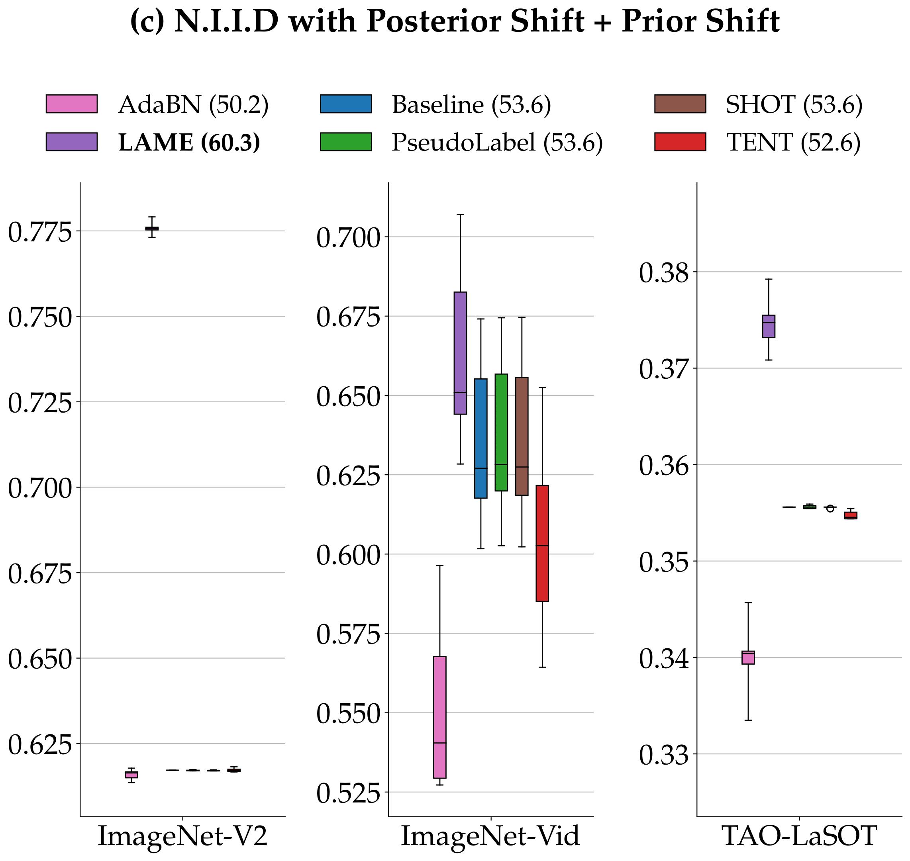

Official code for the paper "Parameter-free Online Test-time Adaptation". To make reproduction as easy as possible, all necessary recipes to reproduce experiments are gathered in the Makefile. Below we detail all the steps to set-up your the environment, download data, models and reproduce all the results in the paper.


## Set up

### Requirements

This project was developed in Python 3.8, with cuda 11.3. First, we encourage you to create a new environment for this project:

```
virtualenv lame
source lame/bin/activate
```

Then, install detectron2 following instructions given in https://detectron2.readthedocs.io/en/latest/tutorials/install.html, and torch following https://pytorch.org/. The remaining requirements for this project should be easily installed through pip:

```bash
pip install -r requirements.txt
```

### Download data / Create splits

First, please set your environment variable DATASET_DIR where all the datasets will be stored:
```
export DATASET_DIR=/path/to/your/data/folder
```

#### ImageNet validation

Please download the imagenet validation set, available at https://academictorrents.com/details/5d6d0df7ed81efd49ca99ea4737e0ae5e3a5f2e5 and place it under $DATASET_DIR/ilsvrc12/. Then execute the following commands:
```
mkdir -p ${DATASET_DIR}/ilsvrc12/val
tar -xv -f ${DATASET_DIR}/ILSVRC2012_img_val.tar -C ${DATASET_DIR}/ilsvrc12/val
cd ${DATASET_DIR}/ilsvrc12/val
wget https://raw.githubusercontent.com/jkjung-avt/jkjung-avt.github.io/master/assets/2017-12-01-ilsvrc2012-in-digits/valprep.sh
bash ./valprep.sh
```

At the end, you should obtain the following structure:

```
.
├── ilsvrc12
│   └── val [1000 entries exceeds filelimit, not opening dir]

```
where val contains 1 folder for each of the 1000 classes.


#### ImageNet-Vid

Please execute the following command:

```
make data/imagenet_vid
```
You should get the following structure:
```
ILSVRC2015/
├── Annotations
│   └── VID
│       ├── train
│       └── val
├── Data
│   └── VID
│       ├── snippets
│       ├── test
│       ├── train
│       └── val
└── ImageSets
    └── VID

```

#### ImageNet-V2

Please execute the following command and follow the instructions to download:

```
make data/imagenet_v2
```

You should get the following structure:

```
imagenet_v2/
├── imagenetv2-matched-frequency-format-val
├── imagenetv2-threshold0.7-format-val
└── imagenetv2-top-images-format-val
```

#### ImageNet-C

Please execute the following command twice, once to download the data and the second to create the splits :

```
make data/imagenet_c
```

You should get the following structure:
```
imagenet_c/
├── test
│   ├── glass_blur
│   ├── impulse_noise
│   ├── jpeg_compression
│   ├── motion_blur
│   ├── pixelate
│   ├── saturate
│   ├── shot_noise
│   ├── snow
│   ├── spatter
│   └── speckle_noise
└── val
    ├── brightness
    ├── contrast
    ├── defocus_blur
    ├── elastic_transform
    ├── fog
    ├── frost
    ├── gaussian_blur
    ├── gaussian_noise
    └── zoom_blur


```

#### Tao

Please execute the following command twice, once to download the data and the second to create the splits :

```
make data/tao
```
You should get a structure like 
```
TAO/
├── annotations
│   ├── checksums
│   └── video-lists
└── frames
    ├── train
    │   ├── ArgoVerse
    │   ├── BDD
    │   ├── Charades
    │   ├── LaSOT
    │   └── YFCC100M
    └── val
        ├── ArgoVerse
        ├── BDD
        ├── Charades
        ├── LaSOT
        └── YFCC100M

```

### Download / convert models

All experiments you will run should automatically download and convert the models they require, but in case you'd still like to download them manually, every model used in this work has its own recipe in the Makefile that you can inspect. 


## Reproduce results


Please note that by default, all commands explicited in the remaining of this section will perform experiments by **looping over all methods** and **using all gpus available** on the current machine/server/cluster. If you only want to produce results for certain methods and using only a subset of GPUS, please use the options:
```
make METHODS=method_1 method_2 GPUS=0,1,2 command
```
will, for instance, execute the command looping over method_1 and method_2, and using gpus 0, 1, 2 on the cluster  (ids as shown with nvidia-smi).


### Validation 

<p align="center">
    
    
</p>

To reproduce Fig.2 of the paper, first execute
```
make validation
```


Once validation is over, please run:
```
make save_best_config  # prints and save the best overall config to /output/validatopn/best_configs
make validation_heatmap  # Reproduce Fig. 2
```


### Test results

##### Figure 3: box plot of test results

<p align="center">
    
</p>

To reproduce Fig.3: 
```
make test
```
followed by:
```
make plot_box
```

##### Figure 4 (top): Robustness w.r.t training

<p align="center">
    
</p>

```
make robustness_training
```
followed by:
```
make plot_spider_training
```

##### Figure 4 (bottom): Robustness w.r.t architecture

<p align="center">
    
</p>

```
make robustness_arch
```
followed by:
```
make plot_spider_arch
```

##### Figure 5: Influence of batch size on the methods

<p align="center">
    
</p>
```
make study_batch_size
```
followed by:
```
make plot_batch
```


##### Figure 6: Runtimes of methods

<p align="center">
    
</p>

```
make runtimes
```
followed by 
```
plot_time
```


## Archiving / restoring results


By default, current results are stored in ./output/, and all plotting scripts will exclusively use results stored in ./output. In order to properly archive some set of results on your current machine, please use:
```
make MODE=[benchmark or validation] store
```

and follows the instructions to give a name to this set of experiments.
If you want to restore any experiment down the road, you can easily do so by executing:
```
make MODE=[benchmark or validation] restore
```
and follow the instructions.


# Acknowledgments

We wish to thank the authors and contributors to https://github.com/facebookresearch/Detectron2, from which this code was largely inspired, for publicly releasing their code and making it easily customizable. We'd also like to thank the authors and contributors to https://github.com/google-research/simclr and https://github.com/lukemelas/PyTorch-Pretrained-ViT for kindly providing pre-trained models.